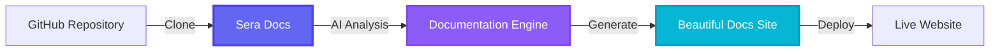
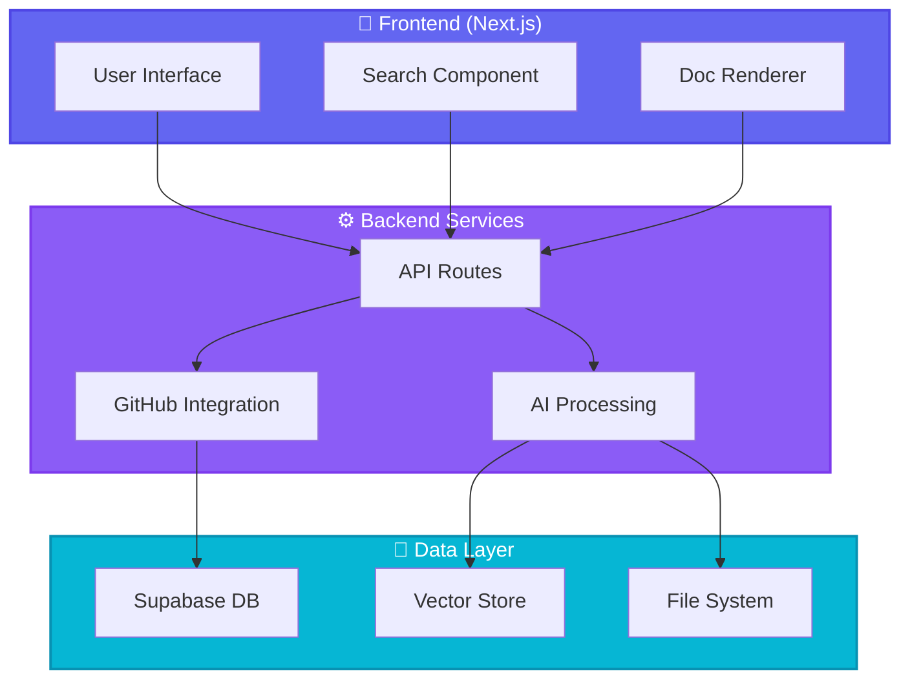
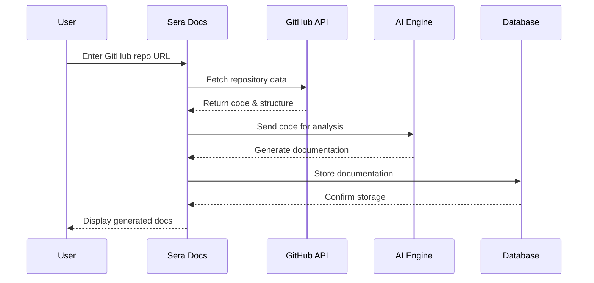
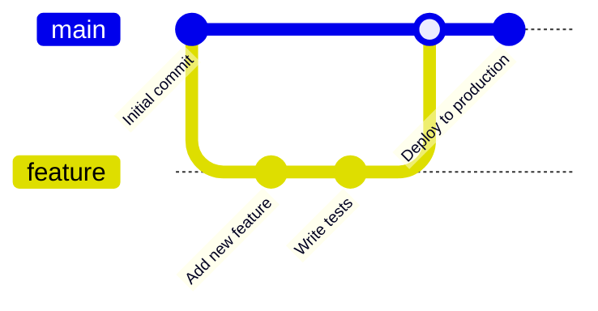

# 🌟 Sera Docs

<div align="center">


**Transform your codebase into beautiful, AI-powered documentation instantly**

[](https://www.typescriptlang.org/)
[](https://nextjs.org/)
[](https://tailwindcss.com/)
[](LICENSE)

[🚀 Live Demo](https://sera-docs.vercel.app) • [📖 Documentation](https://sera-docs.vercel.app/docs) • [🐛 Report Bug](https://github.com/MuditIsOP/Sera-Docs/issues) • [✨ Request Feature](https://github.com/MuditIsOP/Sera-Docs/issues)

</div>

---

## 🎯 What is Sera Docs?

Sera Docs is an **AI-powered documentation generator** that transforms your GitHub repositories into comprehensive, searchable, and beautiful documentation websites. No more manual documentation writing—let AI do the heavy lifting while you focus on building great software.



---

## ✨ Features

<table>
<tr>
<td width="50%">

### 🤖 **AI-Powered Intelligence**
- Automatic code analysis and documentation generation
- Context-aware explanations
- Smart code structure understanding
- Natural language processing for better docs

</td>
<td width="50%">

### 🎨 **Beautiful UI**
- Modern, responsive design
- Dark/Light mode support
- Syntax highlighting
- Interactive code examples

</td>
</tr>
<tr>
<td width="50%">

### 🔍 **Advanced Search**
- Full-text search across all docs
- Instant results
- Search syntax highlighting
- Command palette (⌘+K)

</td>
<td width="50%">

### 🚀 **Developer Experience**
- One-command deployment
- Hot reload in development
- TypeScript support
- Zero configuration

</td>
</tr>
</table>

---

## 🏗️ Architecture



---

## 🚀 Quick Start

### Prerequisites

- Node.js 18+ 
- npm or yarn
- A GitHub account
- Anthropic API key (for AI features)

### Installation

```bash
# Clone the repository
git clone https://github.com/MuditIsOP/Sera-Docs.git

# Navigate to the project directory
cd Sera-Docs

# Install dependencies
npm install
# or
yarn install

# Set up environment variables
cp .env.example .env.local
```

### Configuration

Create a `.env.local` file with the following variables:

```env
# GitHub Configuration
GITHUB_TOKEN=your_github_personal_access_token

# AI Configuration
ANTHROPIC_API_KEY=your_anthropic_api_key

# Database (Supabase)
NEXT_PUBLIC_SUPABASE_URL=your_supabase_url
NEXT_PUBLIC_SUPABASE_ANON_KEY=your_supabase_anon_key
SUPABASE_SERVICE_ROLE_KEY=your_service_role_key

# Optional: Custom Configuration
NEXT_PUBLIC_APP_URL=http://localhost:3000
```

### Run Development Server

```bash
npm run dev
# or
yarn dev
```

Open [http://localhost:3000](http://localhost:3000) to see your app! 🎉

---

## 📖 How It Works



### Step-by-Step Process

1. **Repository Input**: User provides a GitHub repository URL
2. **Code Analysis**: Sera fetches and analyzes the codebase structure
3. **AI Generation**: Claude AI processes the code and generates comprehensive documentation
4. **Smart Organization**: Documentation is automatically organized by file structure
5. **Search Indexing**: Content is indexed for lightning-fast search
6. **Deployment**: Documentation is served through a beautiful, responsive interface

---

## 🛠️ Tech Stack

<div align="center">

| Category | Technologies |
|----------|-------------|
| **Frontend** | Next.js 14, React, TypeScript, Tailwind CSS |
| **Backend** | Next.js API Routes, Node.js |
| **AI/ML** | Anthropic Claude API, Vector Embeddings |
| **Database** | Supabase (PostgreSQL) |
| **Authentication** | NextAuth.js |
| **Deployment** | Vercel |
| **Code Analysis** | Tree-sitter, AST Parsing |

</div>

---

## 📁 Project Structure

```
Sera-Docs/
├── 📂 app/                    # Next.js 14 App Router
│   ├── 📂 api/               # API routes
│   ├── 📂 docs/              # Documentation pages
│   └── 📂 dashboard/         # User dashboard
├── 📂 components/            # React components
│   ├── 📂 ui/               # UI components
│   ├── 📂 docs/             # Doc-specific components
│   └── 📂 search/           # Search components
├── 📂 lib/                   # Utility functions
│   ├── 📂 ai/               # AI integration
│   ├── 📂 github/           # GitHub API
│   └── 📂 db/               # Database utilities
├── 📂 public/                # Static assets
└── 📂 types/                 # TypeScript types
```

---

## 🎨 Screenshots

<div align="center">

### 🏠 Home Page
*Beautiful landing page with clear call-to-action*

### 📚 Documentation View
*Clean, readable documentation with syntax highlighting*

### 🔍 Smart Search
*Instant search with keyboard shortcuts*

### 🌙 Dark Mode
*Eye-friendly dark theme for late-night coding*

</div>

---

## 🤝 Contributing

We love contributions! Here's how you can help:



### Contribution Process

1. **Fork** the repository
2. **Create** a feature branch (`git checkout -b feature/AmazingFeature`)
3. **Commit** your changes (`git commit -m 'Add some AmazingFeature'`)
4. **Push** to the branch (`git push origin feature/AmazingFeature`)
5. **Open** a Pull Request

### Development Guidelines

- Write clean, documented code
- Follow the existing code style
- Add tests for new features
- Update documentation as needed
- Be respectful and constructive

---

## 📊 Roadmap

- [x] **Phase 1**: Core documentation generation
- [x] **Phase 2**: GitHub integration
- [x] **Phase 3**: AI-powered analysis
- [ ] **Phase 4**: Multi-language support (Python, Java, Go)
- [ ] **Phase 5**: VS Code extension
- [ ] **Phase 6**: Collaborative editing
- [ ] **Phase 7**: API documentation generator
- [ ] **Phase 8**: Custom theming engine

---

## 🐛 Known Issues & Limitations

- Large repositories (>100MB) may take longer to process
- Rate limiting on GitHub API for free accounts
- AI generation requires active internet connection
- Currently optimized for JavaScript/TypeScript projects

See [Issues](https://github.com/MuditIsOP/Sera-Docs/issues) for a full list of known issues and feature requests.

---

## 📝 License

This project is licensed under the MIT License - see the [LICENSE](LICENSE) file for details.

---

## 💖 Acknowledgments

- **Anthropic** for the amazing Claude AI API
- **Vercel** for seamless deployment
- **Supabase** for the backend infrastructure
- **The Open Source Community** for inspiration and support

---

## 📬 Contact & Support

<div align="center">

**Have questions? We're here to help!**

[](https://github.com/MuditIsOP/Sera-Docs/issues)
[](mailto:mudit8sharma@gmail.com)

**Show your support!**

⭐ Star this repo if you find it useful!

</div>

---

<div align="center">

**Built with ❤️ by [MuditIsOP](https://github.com/MuditIsOP)**

*Making documentation beautiful, one repository at a time.*

</div>
