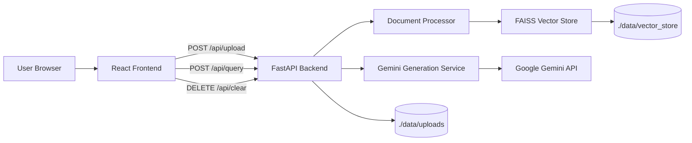

# Sera Docs (RAG Application)


## TL;DR
Sera Docs is a document Q&A web app: users upload files, the backend extracts text and chunks it, embeddings are stored in a local FAISS index, and queries return relevant chunks plus an optional Gemini-generated answer with citations (source: `backend/app/main.py`, `backend/app/services/document_processor.py`, `backend/app/services/vector_store.py`, `backend/app/services/generation.py`).

## How It Works in 60 Seconds
1. User uploads `pdf/docx/pptx/txt/csv/html` via React UI (source: `frontend/src/components/FileUpload.jsx`).
2. FastAPI validates size/type, saves the file, extracts text, chunks text with overlap, then embeds + indexes chunks in FAISS (source: `backend/app/main.py`, `backend/app/services/document_processor.py`, `backend/app/services/vector_store.py`).
3. User asks a question in chat; backend does semantic retrieval (`top_k`) and optionally asks Gemini to generate a friendly answer constrained to retrieved context (source: `backend/app/main.py`, `backend/app/services/generation.py`).
4. UI shows answer + clickable sources, including chunk metadata and similarity score (source: `frontend/src/components/ChatInterface.jsx`, `frontend/src/components/SourceViewer.jsx`).

---

## Project Identity

### Purpose
Help users search and chat with their own documents using retrieval-augmented generation (RAG), with source-grounded answers (source: `backend/app/main.py`, `frontend/src/App.jsx`).

### Problem Solved
Raw document sets are hard to search conversationally; this app adds semantic retrieval and optional LLM response generation over ingested files (source: `backend/app/services/vector_store.py`, `backend/app/services/generation.py`).

### Target Users (Inferred)
- Individuals or small teams who want quick Q&A over local/business documents.
- Users comfortable with lightweight self-hosted/local deployment.

Reason this is inferred: no explicit product spec exists; this is deduced from features, deployment files, and UI copy (source: `frontend/src/App.jsx`, `docker-compose.yml`, `Dockerfile`).

### Core Product Surface
| Area | Capability | Evidence |
|---|---|---|
| Ingestion | Upload multiple files with drag/drop and format restrictions | `frontend/src/components/FileUpload.jsx`, `backend/app/main.py` |
| Retrieval | Semantic search over chunk embeddings | `backend/app/services/vector_store.py` |
| Generation | Optional Gemini response using retrieved chunks as context | `backend/app/main.py`, `backend/app/services/generation.py` |
| Explainability | Source chips + source detail modal with metadata/scores | `frontend/src/components/ChatInterface.jsx`, `frontend/src/components/SourceViewer.jsx` |
| Ops | Clear vector store and uploaded files | `backend/app/main.py` |
| UX Extras | Dark mode, speech-to-text, text-to-speech | `frontend/src/App.jsx`, `frontend/src/components/ChatInterface.jsx` |

---

## Repository Walkthrough

```text
.
├─ backend/
│  ├─ app/
│  │  ├─ main.py                  # FastAPI entrypoint + routes
│  │  ├─ core/config.py           # Settings/env parsing
│  │  ├─ models/schemas.py        # Request/response schemas
│  │  └─ services/
│  │     ├─ document_processor.py # Extraction + chunking
│  │     ├─ vector_store.py       # Embeddings + FAISS + persistence
│  │     └─ generation.py         # Gemini prompting/generation
│  ├─ requirements.txt
│  └─ Dockerfile
├─ frontend/
│  ├─ src/
│  │  ├─ main.jsx                 # React bootstrap
│  │  ├─ App.jsx                  # Main shell + state orchestration
│  │  ├─ utils/api.js             # API client
│  │  └─ components/
│  │     ├─ FileUpload.jsx
│  │     ├─ ChatInterface.jsx
│  │     └─ SourceViewer.jsx
│  ├─ package.json
│  ├─ vite.config.js
│  ├─ tailwind.config.js
│  ├─ nginx.conf
│  └─ Dockerfile
├─ .github/workflows/deploy-frontend.yml
├─ docker-compose.yml
├─ Dockerfile                     # Full-stack single-container build
├─ Dockerfile.railway             # Backend-only deployment variant
├─ railway.json
└─ .env.example
```

Entry points:
- Backend runtime: `uvicorn app.main:app` (source: `backend/Dockerfile`, `railway.json`, `Dockerfile`).
- Frontend runtime (dev): `vite` (source: `frontend/package.json`).
- Frontend runtime (prod container): `nginx` serving `dist` (source: `frontend/Dockerfile`, `frontend/nginx.conf`).

---

## Tech Stack and Why It Exists

| Layer | Technology | Why it is used (code evidence) |
|---|---|---|
| API | FastAPI + Pydantic | Typed request/response models and async endpoints (`/api/upload`, `/api/query`, etc.) (source: `backend/app/main.py`, `backend/app/models/schemas.py`) |
| Retrieval | sentence-transformers + FAISS | Embedding generation + fast nearest-neighbor search (source: `backend/app/services/vector_store.py`) |
| LLM | Google Gemini (`google-generativeai`) | Optional natural-language answer synthesis from retrieved chunks (source: `backend/app/services/generation.py`) |
| Parsing | pypdf, python-docx, python-pptx, BeautifulSoup, pandas | Multi-format text extraction (source: `backend/app/services/document_processor.py`) |
| Frontend | React + Vite + Tailwind + Framer Motion | UI, build tooling, utility styling, motion UX (source: `frontend/package.json`, `frontend/src/*.jsx`) |
| HTTP client | Native `fetch` wrapper | API calls with JSON/FormData support (source: `frontend/src/utils/api.js`) |
| Containerization | Docker, Docker Compose, Nginx | Local and deployment packaging (source: `Dockerfile`, `backend/Dockerfile`, `frontend/Dockerfile`, `docker-compose.yml`) |
| CI/CD | GitHub Actions Pages workflow | Frontend build and deploy to GitHub Pages (source: `.github/workflows/deploy-frontend.yml`) |

---

## Architecture


```mermaid
flowchart LR
  U[User Browser] --> FE[React Frontend]
  FE -->|POST /api/upload| BE[FastAPI Backend]
  FE -->|POST /api/query| BE
  FE -->|DELETE /api/clear| BE
  BE --> DP[Document Processor]
  DP --> VS[FAISS Vector Store]
  BE --> GS[Gemini Generation Service]
  GS --> G[Google Gemini API]
  VS --> D[(./data/vector_store)]
  BE --> F[(./data/uploads)]
```

### Boundaries
- Frontend handles interaction/state and invokes backend APIs (source: `frontend/src/App.jsx`, `frontend/src/utils/api.js`).
- Backend handles ingestion, retrieval, generation, and persistence (source: `backend/app/main.py`, `backend/app/services/*`).

### End-to-End Request/Data Flow
1. Upload request sends multipart file.
2. Backend validates extension + size, writes to `./data/uploads`.
3. Extractor converts file to text.
4. Chunker splits by word window (`chunk_size`, `chunk_overlap`).
5. Embedder produces vectors; FAISS index + metadata list updated and persisted.
6. Query embeds user text, retrieves top-k, maps scores.
7. If enabled and context exists, Gemini prompt is generated and answered.
8. UI renders answer and source chunks.

(source: `backend/app/main.py`, `backend/app/services/document_processor.py`, `backend/app/services/vector_store.py`, `backend/app/services/generation.py`, `frontend/src/components/ChatInterface.jsx`)

### State Management Strategy
- Frontend uses local React state (`useState`), no global store library (source: `frontend/src/App.jsx`, `frontend/src/components/ChatInterface.jsx`).
- Backend uses in-process singleton services (`vector_store`, `generation_service`) and filesystem persistence (source: `backend/app/services/vector_store.py`, `backend/app/services/generation.py`).

### Background Jobs / Queues / Workers
None present. All ingestion and query work runs inline in API requests (source: `backend/app/main.py`).

---

## Data Layer

### Storage Systems
| Data | Mechanism | Path |
|---|---|---|
| Uploaded source files | Filesystem | `./data/uploads` |
| Vector index | FAISS binary | `./data/vector_store/faiss_index.bin` |
| Chunk metadata/documents | Pickle file | `./data/vector_store/documents.pkl` |

(source: `backend/app/main.py`, `backend/app/services/vector_store.py`)

### Logical Data Model
- `DocumentChunk`: `chunk_id`, `content`, `metadata`, `similarity_score?` (source: `backend/app/models/schemas.py`).
- Metadata contains filename, file_type, file_path, and chunk offsets/index (source: `backend/app/services/document_processor.py`).
- Query response returns `query`, `answer?`, `sources[]`, `timestamp` (source: `backend/app/models/schemas.py`).

### Caching/Sessions
- No explicit cache layer.
- No session/auth tokens; app is stateless per request, except vector data stored on disk/in-memory singleton (source: `backend/app/main.py`, `backend/app/services/vector_store.py`).

---

## Auth, Security, Permissions

### Current Security Posture
- No authentication/authorization on API endpoints (source: `backend/app/main.py`).
- CORS is configurable, defaults include localhost + one GitHub Pages origin (source: `backend/app/core/config.py`).
- File validation includes extension allowlist, empty-file check, and max-size check (source: `backend/app/main.py`).

### Secrets Handling
- Gemini key pulled from env (`GEMINI_API_KEY`) via settings model (source: `backend/app/core/config.py`, `.env.example`).

### Notable Gaps
- Destructive `DELETE /api/clear` has no auth guard.
- Pickle storage is convenient but unsafe if untrusted pickle files are introduced.
- No rate limiting, request throttling, or abuse controls.
- No malware/content scanning for uploads.

(source: `backend/app/main.py`, `backend/app/services/vector_store.py`)

---

## AI/ML Behavior

### Embedding + Retrieval
- Embedding model default: `all-MiniLM-L6-v2`.
- Similarity: FAISS `IndexFlatL2`, converted score `1 / (1 + distance)`.
- Top-k default 5; request can override 1..20.

(source: `backend/app/core/config.py`, `backend/app/services/vector_store.py`, `backend/app/models/schemas.py`)

### Generation
- Model: `gemini-2.5-flash`.
- Prompt injects persona + strict instruction to use provided context and cite `[Source N]`.
- If API key missing, returns a plain explanatory message.

(source: `backend/app/services/generation.py`)

### Guardrails
- Soft prompt-only guardrails; no structured output validation or moderation layer visible.

(source: `backend/app/services/generation.py`)

---

## API Surface

| Method | Path | Purpose | Input | Output |
|---|---|---|---|---|
| `GET` | `/` | Health/info | None | `{name, version, status}` |
| `POST` | `/api/upload` | Upload + ingest file | multipart file | `FileUploadResponse` |
| `POST` | `/api/query` | Retrieve (+ optional generate) | `QueryRequest` | `QueryResponse` |
| `GET` | `/api/status` | Vector store stats | None | `IngestionStatus` |
| `DELETE` | `/api/clear` | Wipe index + uploaded files | None | `{message}` |

(source: `backend/app/main.py`, `backend/app/models/schemas.py`)

Error behavior:
- Validation and operational errors use `HTTPException`; custom handler normalizes shape to `{ "error": ... }`.
- `/api/query` generation errors are returned as answer text string when caught inside generation service.

(source: `backend/app/main.py`, `backend/app/services/generation.py`)

Rate limits:
- No server-side rate limiting found (source: `backend/app/main.py`).

---

## Frontend UX Map

### Screens/Regions
- Single-page app with three core regions: upload panel, chat panel, and source details modal (source: `frontend/src/App.jsx`, `frontend/src/components/SourceViewer.jsx`).

### Interaction Highlights
- Multi-file drag/drop upload with MIME + extension constraints and per-file sequential upload (source: `frontend/src/components/FileUpload.jsx`).
- Chat with loading state, source chips, markdown rendering (source: `frontend/src/components/ChatInterface.jsx`).
- Voice input via `SpeechRecognition` and read-aloud via `speechSynthesis` (source: `frontend/src/components/ChatInterface.jsx`).
- Dark mode persisted in `localStorage` (source: `frontend/src/App.jsx`).

### Validation/Error/Loading
- Frontend surfaces alerts/system messages for upload/query/clear failures.
- Backend-side validation handles extension/size/empty file checks.

(source: `frontend/src/App.jsx`, `backend/app/main.py`)

---

## DevEx and Operations

## Quick Start (Local, Split Services)

### Prerequisites
- Python 3.11+
- Node.js 18+
- npm

### 1) Backend
```bash
cd backend
python -m venv .venv
# Windows
.venv\Scripts\activate
# macOS/Linux
source .venv/bin/activate
pip install -r requirements.txt
uvicorn app.main:app --host 0.0.0.0 --port 8000 --reload
```

### 2) Frontend
```bash
cd frontend
npm ci
npm run dev
```

Frontend default dev URL: `http://localhost:3000` (source: `frontend/vite.config.js`).

## Quick Start (Docker Compose)
```bash
docker compose up --build
```
- Frontend: `http://localhost`
- Backend: `http://localhost:8000`

(source: `docker-compose.yml`, `frontend/nginx.conf`)

## Single-Container Build (Frontend bundled into backend static)
```bash
docker build -t sera-docs .
docker run -p 8000:8000 --env GEMINI_API_KEY=your_key sera-docs
```

(source: `Dockerfile`, `backend/app/main.py`)

## Environment Variables
| Variable | Default | Purpose |
|---|---|---|
| `GEMINI_API_KEY` | empty | Enables Gemini generation |
| `EMBEDDING_MODEL` | `all-MiniLM-L6-v2` | Embedding model |
| `CHUNK_SIZE` | `500` | Chunk window size (words) |
| `CHUNK_OVERLAP` | `100` | Word overlap |
| `TOP_K_RESULTS` | `5` | Default retrieval count |
| `MAX_FILE_SIZE` | `52428800` | Max upload size in bytes |
| `CORS_ORIGINS` | list | Allowed browser origins |
| `HOST` | `0.0.0.0` | API bind host |
| `PORT` | `8000` | API port |

(source: `backend/app/core/config.py`)

> [!NOTE]
> `.env.example` uses `BACKEND_HOST/BACKEND_PORT` naming, but the app settings model expects `HOST/PORT` unless Pydantic env aliases are added. Treat this as a config mismatch to fix (source: `.env.example`, `backend/app/core/config.py`).

## Deployment Paths
- GitHub Pages for frontend (workflow builds `frontend/dist`) (source: `.github/workflows/deploy-frontend.yml`).
- Railway backend via Dockerfile in `backend/` and runtime `uvicorn ... --port $PORT` (source: `railway.json`, `Dockerfile.railway`).

---

## Testing and Quality

### What Exists
- `pytest` and `pytest-asyncio` are dependencies (source: `backend/requirements.txt`).
- Frontend lint script exists: `npm run lint` (source: `frontend/package.json`).

### Current Gaps (from repository contents)
- No test files found in tracked tree.
- No backend lint/format config (e.g., `ruff`, `black`, `mypy`) found.
- No frontend test harness (`vitest/jest/cypress`) found.

(source: repository file inventory)

---

## Production Readiness Checklist

- [ ] Add API authentication and route-level authorization, especially for `DELETE /api/clear`.
- [ ] Add request size/time/rate limiting.
- [ ] Replace or protect pickle persistence path; verify trust boundaries.
- [ ] Add structured logging + correlation IDs.
- [ ] Add health/readiness endpoints for dependencies.
- [ ] Add automated tests (upload parsing, retrieval correctness, query contract).
- [ ] Pin and monitor model/provider behavior (Gemini and embedding model).
- [ ] Resolve frontend API base mismatch (`api.js` hardcoded URL vs `VITE_API_URL` pattern).
- [ ] Harden CORS and deployment env handling.
- [ ] Add backup/restore plan for `data/vector_store` and upload storage.

---

## Troubleshooting Matrix

| Symptom | Likely Cause | How to Verify | Fix |
|---|---|---|---|
| Upload fails with file type error | Extension not in allowlist | Check response error and `allowed_extensions` | Add allowed type in config or upload supported formats |
| Upload fails with size error | File exceeds max bytes | Compare file size vs `MAX_FILE_SIZE` | Increase `MAX_FILE_SIZE` in env |
| Query returns sources but no natural-language answer | `GEMINI_API_KEY` missing | Response contains key-missing message | Set `GEMINI_API_KEY` |
| Query returns empty sources | No indexed data or mismatch query | `GET /api/status` shows zero chunks | Upload docs first; confirm ingestion succeeded |
| Frontend calls wrong backend in local dev | `api.js` hardcodes Render URL | Inspect network requests | Replace with env-driven base URL |
| Docker frontend can’t reach backend | Proxy/hostname mismatch | Check nginx `/api` proxy and compose service names | Keep backend service name `backend` in compose |

(source: `backend/app/main.py`, `backend/app/core/config.py`, `frontend/src/utils/api.js`, `frontend/nginx.conf`, `docker-compose.yml`)

---

## Known Issues and Priority Roadmap

### Known Issues (code-evidenced)
1. Config inconsistency between `.env.example` and actual backend settings field names.
2. Frontend API base hardcoded to production URL, which can conflict with local/proxy setups.
3. No auth around destructive/expensive API endpoints.
4. Ingestion/query operations are synchronous and can block under large workloads.

(source: `.env.example`, `backend/app/core/config.py`, `frontend/src/utils/api.js`, `backend/app/main.py`)

### Suggested Roadmap
1. Security hardening: auth + RBAC-lite + rate limiting.
2. Config cleanup: unified env contract for frontend/backend.
3. Reliability: background ingestion queue and async worker.
4. Quality: API and e2e tests + CI quality gates.
5. Observability: structured logs, metrics, tracing.

---

## FAQ

<details>
<summary><strong>Does this store my documents in a database?</strong></summary>
No relational DB is used. Files are stored on disk and embeddings/chunk metadata are persisted in FAISS + pickle files (source: `backend/app/main.py`, `backend/app/services/vector_store.py`).
</details>

<details>
<summary><strong>Can I use the app without Gemini?</strong></summary>
Yes. Retrieval still works; generated answer text is replaced with a key-missing message when `GEMINI_API_KEY` is unset (source: `backend/app/services/generation.py`).
</details>

<details>
<summary><strong>What file formats can I upload?</strong></summary>
`pdf`, `docx`, `pptx`, `txt`, `csv`, `html` (source: `backend/app/core/config.py`, `frontend/src/components/FileUpload.jsx`).
</details>

<details>
<summary><strong>Does it support multi-user isolation?</strong></summary>
Not currently. The vector store is global for the running backend process (source: `backend/app/services/vector_store.py`).
</details>

---

## Contributing Guide

1. Fork and create a feature branch.
2. Run backend and frontend locally.
3. Keep changes scoped and include tests where possible.
4. Validate API contract stability (`/api/upload`, `/api/query`, `/api/status`, `/api/clear`).
5. Run frontend lint before opening PR:
```bash
cd frontend
npm run lint
```
6. For backend changes, add or update pytest coverage.

Suggested commit areas:
- `backend/app/services/*` for ingestion/retrieval/generation internals.
- `frontend/src/components/*` for UX behavior.
- Deployment/config under root files and `.github/workflows`.

---

## License
MIT License (source: `LICENSE`).

## Credits / Attribution
- Project author/copyright holder listed in license: **Mudit Sharma** (source: `LICENSE`).
- Upstream OSS dependencies credited via `backend/requirements.txt` and `frontend/package.json`.

---

## Evidence Map

Key files used for reverse engineering:
- `backend/app/main.py`
- `backend/app/core/config.py`
- `backend/app/models/schemas.py`
- `backend/app/services/document_processor.py`
- `backend/app/services/vector_store.py`
- `backend/app/services/generation.py`
- `backend/requirements.txt`
- `backend/Dockerfile`
- `frontend/src/App.jsx`
- `frontend/src/components/ChatInterface.jsx`
- `frontend/src/components/FileUpload.jsx`
- `frontend/src/components/SourceViewer.jsx`
- `frontend/src/utils/api.js`
- `frontend/package.json`
- `frontend/vite.config.js`
- `frontend/tailwind.config.js`
- `frontend/Dockerfile`
- `frontend/nginx.conf`
- `docker-compose.yml`
- `Dockerfile`
- `Dockerfile.railway`
- `railway.json`
- `.github/workflows/deploy-frontend.yml`
- `.env.example`
- `.gitignore`
- `.dockerignore`
- `LICENSE`
